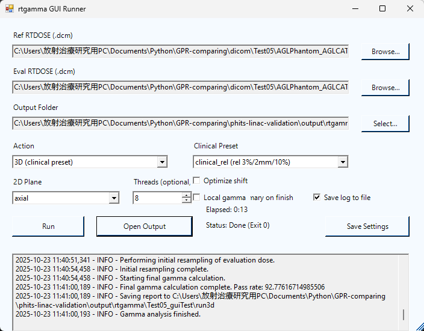

# rtgamma — DICOM RTDOSE Gamma Analysis (2D/3D)

Fast and reproducible gamma analysis for DICOM RTDOSE pairs with robust geometry handling, CLI/GUI, and lightweight docs/specs.

This README is normalized to UTF-8 (no BOM). For prior details, see CHANGELOG and docs under docs/openspec/.

## Features
- 2D/3D gamma with shift optimization (coarse→fine, early stop) and 2D fast path
- DICOM geometry fidelity (IPP/IOP/PixelSpacing/GFOV; GFOV-order alignment)
- Global and Local gamma selection
- CLI and Windows GUI (PowerShell/WinForms)
- Reports (CSV/JSON/MD), optional NPZ saves, and schema validation
- OpenSpec docs with examples and helper scripts

## Install
- Python 3.9+
- Dependencies:
  - `pip install pydicom numpy scipy matplotlib numba`

## Quick Start (CLI)
- 3D analysis (report only)
  - `python -m rtgamma.main --ref dicom/PHITS_Iris_10_rtdose.dcm --eval dicom/RTD.deposit-3D-Lung16Beams-1.5-10-8.dcm --mode 3d --report phits-linac-validation/output/rtgamma/run3d`
- 2D axial (central slice, save images)
  - `python -m rtgamma.main --mode 2d --plane axial --plane-index auto --ref <ref.dcm> --eval <eval.dcm> --save-gamma-map out/gamma.png --save-dose-diff out/diff.png --report out/axial`

## Clinical Presets and Threads
- Presets: `--profile {clinical_abs,clinical_rel,clinical_2x2,clinical_3x3}` (shift OFF)
- Threads: `--threads <N>` to control Numba parallelism (0=auto)

## Global vs Local Gamma
- Select with `--gamma-type {global,local}` (default: global)
- GUI toggle: Local gamma (default OFF)
- Guide and examples: see `GPR_Global_vs_Local.md`

## Geometry and Coordinates
- Obeys DICOM IPP/IOP/PixelSpacing/GFOV; frames sorted by ascending GFOV
- 2D plane grids align to array order (z,y,x) with a singleton axis for the fixed dimension

## Outputs
- 2D images: PNG/TIFF (`--save-gamma-map`, `--save-dose-diff`)
- 3D arrays: NPZ (`--save-gamma-map`, `--save-dose-diff`)
- Reports: CSV/JSON/MD (`--report <basepath>`) with geometry sanity fields

## GUI
- Launch: double-click `run_gui.bat` (or run `scripts/run_gui.ps1`)
- Pick Ref/Eval RTDOSE, select output folder, choose Action (Header/3D/2D), preset, plane, threads
- Comfort: live log, status, elapsed, auto-open summary, save log; Local gamma toggle
- Details: `docs/openspec/GUI_RUN.md`
 
### Screenshots (small, optional)
- docs/openspec/images/gui_main.png
- docs/openspec/images/gui_after_run3d.png
- docs/openspec/images/gui_after_run2d_axial.png
- Helper: powershell -NoProfile -ExecutionPolicy Bypass -File scripts\capture_gui_screens.ps1 -OutDir docs/openspec/images -DelayMs 1500

- Available example:
  - docs/openspec/images/Gui-screenshot.png
  
  

## OpenSpec and Validation
- Docs/specs: `docs/openspec/` (README, TEMPLATE, `report.schema.json`, examples, `rtgamma_openspec.md`)
- Validate a report JSON:
  - `python scripts/validate_report.py --sanitize-nan phits-linac-validation/output/rtgamma/spec_check/axial.json`
- Compare a 3D gamma slice vs a 2D report:
  - `python scripts/compare_slice_gpr.py <gamma3d.npz> --plane coronal --index 101 --report2d <coronal_101.json>`

### Japanese Docs
- Full Japanese spec: `docs/openspec/rtgamma_spec_JA.md`
- Illustrated Global/Local guide: `docs/openspec/Global_Local_Illustrated_JA.md`
- FAQ (JA): `docs/openspec/FAQ_JA.md`

## Testing
- Lightweight tests: `pytest -q`
- Includes gamma local vs global checks and I/O/header utilities

## Notes
- Prefer UTF-8 (no BOM) for Markdown on Windows
- Do not commit PHI; use anonymized test DICOM only
- Write outputs under `phits-linac-validation/output/rtgamma/`

## Recent Updates (2025-10-23)
- Local gamma support (`--gamma-type local`); GUI toggle added
- OpenSpec initialized; report schema and validators included
- Slice consistency helper script added
- Reproducible 2D/3D commands and validation steps documented

## 免責事項 / Disclaimer

## 重要: 研究目的のみに使用 (Important Notice)

### 研究用途限定 (For Research Use Only)

本ソフトウェアおよび付随ドキュメントは、いわゆる「研究目的のみに使用（Research Use Only）」のために提供されています。

いかなる場合であっても、臨床診断、治療計画、品質保証（QA）、患者ケアに直接関連するいかなる目的にも使用しないでください。本ソフトウェアの出力や可視化結果を臨床判断に用いてはなりません。

This software and associated documentation are provided for Research Use Only.
Under no circumstances should this software be used for clinical diagnosis, treatment planning, quality assurance (QA), or any other purpose related to direct patient care. Do not use results from this software for clinical decisions.

### 無保証 (No Warranty)

本ソフトウェアは MIT ライセンスに基づき「現状有姿（AS IS）」で提供されます。商品性、特定目的適合性、権利非侵害を含む、明示または黙示を問わず、いかなる保証も行いません。

This software is provided "AS IS" under the MIT License, without warranty of any kind, express or implied, including but not limited to the warranties of merchantability, fitness for a particular purpose and noninfringement.

### 責任制限 (Limitation of Liability)

著作者または権利者は、本ソフトウェアの使用、動作、または取引に起因または関連して発生した、あらゆる請求・損害・その他の責任について、契約、不法行為、その他のいかなる原因においても一切責任を負いません。

In no event shall the authors or copyright holders be liable for any claim, damages or other liability, whether in an action of contract, tort or otherwise, arising from, out of or in connection with the software or the use or other dealings in the software.

### 利用者の責任 (User's Responsibility)

本ソフトウェアの利用および結果の解釈は、利用者自身の責任で行ってください。
本ソフトウェアにより生成された結果の正確性・適合性・信頼性については、利用者が独自に検証するものとします。

All use of this software and interpretation of its results is at the user's own risk. The user is solely responsible for independently verifying the accuracy, suitability, and reliability of any results generated by this software.
