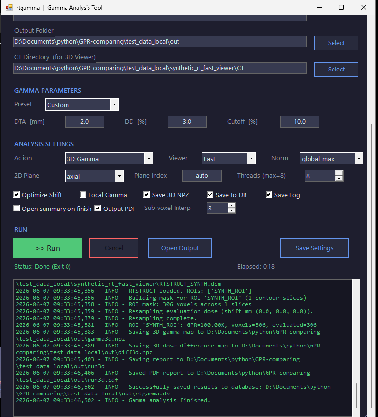

# rtgamma — DICOM RTDOSE ガンマ解析 (2D/3D)

本プロジェクトは、DICOM RTDOSE 同士の 2D/3D ガンマ解析を高速かつ再現性高く実行するためのツール群です。幾何整合（IPP/IOP/PixelSpacing/GFOV）を厳密に扱い、CLI と Windows GUI を提供します。エンコーディングは UTF-8（BOMなし）を推奨します。

## 主な機能
- 2D/3D ガンマ解析（粗→細のシフト最適化、早期打ち切り）、2D 高速経路
- 幾何の忠実性（IPP/IOP/PixelSpacing/GFOV。GFOV 昇順でフレーム整列）
- ガンマ種別: Global / Local（`--gamma-type {global,local}`）
- レポート: CSV / JSON / MD、オプションで 3D NPZ 出力
- OpenSpec ドキュメントと検証スクリプト

## インストールと実行
### 方法 A: 実行ファイル (Windows EXE)
Python環境がない場合は、Releases からビルド済みの `rtgamma_vX.X.X.zip` をダウンロード・展開し、同梱のランチャーを実行してください。（内部的に `.exe` ファイルが自動的に呼び出されます。）

- Legacy ZIP: 軽量配布です。PySide6/Qt は同梱せず、3D Viewer の既定は Legacy です。Fast を選んだ場合は、Fast ZIP または Python/source mode のセットアップが必要です。
- Fast ZIP: PySide6/Qt/pyqtgraph を同梱した大容量配布です。3D Viewer の既定は Fast です。`NOTICE.txt`、`THIRD_PARTY_LICENSES/`、`bundled_manifest.txt` を同梱し、第三者コンポーネントは各ライセンスに従います。

### 方法 B: Python ソースからの実行
- Python 3.9+
- 依存関係: `pip install pydicom numpy scipy matplotlib numba`
- Fast Viewer を使う場合: `pip install -r requirements-fast-viewer.txt` または `setup_fast_viewer_venv.bat`
- Python/source mode では、保存済み設定がなければ3D Viewerの既定は Fast です。Legacy は引き続き選択できます。
- パッケージ化（開発者向け）: `scripts/build_exe.ps1` を実行することで PyInstaller による `.exe` 生成が可能です。

## クイックスタート（CLI）
- 3D 解析（レポートのみ）
  - `python -m rtgamma.main --ref dicom/PHITS_Iris_10_rtdose.dcm --eval dicom/RTD.deposit-3D-Lung16Beams-1.5-10-8.dcm --mode 3d --report phits-linac-validation/output/rtgamma/run3d`
- 2D axial（中央スライス、画像保存）
  - `python -m rtgamma.main --mode 2d --plane axial --plane-index auto --ref <ref.dcm> --eval <eval.dcm> --save-gamma-map out/gamma.png --save-dose-diff out/diff.png --report out/axial`

## 臨床プリセットとスレッド
- `--profile {clinical_abs,clinical_rel,clinical_2x2,clinical_3x3}`（既定はシフト OFF）
- `--threads <N>` で Numba 並列数を指定（0=auto）

## Global と Local の概要
- `--gamma-type {global,local}`（既定: global）
- GUI では「Local gamma」チェックボックス（既定 OFF）
- ガイド: `GPR_Global_vs_Local.md`

## 幾何と座標系
- DICOM の IPP/IOP/PixelSpacing/GFOV を尊重し、GFOV 昇順で z を整列
- 2D 平面グリッドは配列軸 (z,y,x) に整合（固定次元は単一軸）

## 出力
- 2D 画像: PNG/TIFF（`--save-gamma-map`, `--save-dose-diff`）
- 3D 配列: NPZ（`--save-gamma-map`, `--save-dose-diff`）
- レポート: CSV/JSON/MD（幾何サニティ項目を含む）

## GUI の使い方
- 起動: Source/Python mode は `run_gui_python.bat`、配布ZIPは同梱のGUIランチャー
- 入力: Ref/Eval の RTDOSE、出力フォルダを指定
- モード: Header Compare / 3D / 2D、プリセット、平面、Threads を設定
- 3D Viewer: Fast Viewer固定。Fast起動に失敗した場合は、例外要約、依存関係、ログパスを表示します。
- 快適機能: 進捗表示、ログ保存、サマリ自動オープン、Local gamma トグル
- 詳細: `docs/openspec/GUI_RUN.md`

## 🛠 外部ツールとの連携
本ツールの GUI は起動時に `config/gui_config.ini` を読み込みます。外部スクリプト（`dicom-phits_inp` など）からこの INI ファイルを事前に書き換えることで、特定の DICOM ファイルや解析結果を選択した状態でシームレスにビュアーを起動することが可能です。

**主な設定項目 (`[Paths]` セクション):**
- `ref_dose`: 参照線量のパス
- `eval_dose`: 評価線量のパス
- `ct_dir`: CT 画像ディレクトリのパス
- `output_dir`: 解析結果（`gamma_map.npz` 等）が含まれるディレクトリのパス

### スクリーンショット
- `docs/openspec/images/Gui-screenshot.png`

## OpenSpec と検証
- 仕様: `docs/openspec/`（README, TEMPLATE, `report.schema.json`, `rtgamma_openspec.md` ほか）
- レポートJSON検証:
  - `python scripts/validate_report.py --sanitize-nan phits-linac-validation/output/rtgamma/spec_check/axial.json`
- 3D スライス vs 2D レポートの一致確認:
  - `python scripts/compare_slice_gpr.py <gamma3d.npz> --plane coronal --index 101 --report2d <coronal_101.json>`

## テスト
- 軽量テスト: `pytest -q`（Local vs Global のチェック等を含む）

## 注意
- Markdown は UTF-8（BOM なし）推奨（Windows での文字化け回避）
- PHI を含む DICOM はコミット禁止（匿名化サンプルのみ）
- 出力は `phits-linac-validation/output/rtgamma/` 配下へ

## 最近の更新（2026-03-06: v0.6.0）
- PyInstaller によるスタンドアロン EXE パッケージの自動ビルド機能と GUI 統合を追加
- GUI のパラメータ設定項目に詳細な解説ツールチップを実装
- GUI からのワンクリック PDF 定型帳票生成に対応
- サブボクセル内挿（Sub-voxel Interpolation）の実装により、実測線量データとのガンマ一致率を 3DVH 並みに向上

## 参照資料
- docs/openspec/Global_Local_Illustrated_JA.md
- docs/openspec/FAQ_JA.md

## **免責事項 / Disclaimer**

## **⚠️ 重要：使用上の注意 (Important Notice)**

### **1\. 本ソフトウェアの位置づけ (Software Status)**

本ソフトウェアは、作者個人の研究成果として公開されているものであり、**医療機器としての承認（薬機法等）を受けたものではありません。**

標準的な治療計画装置（TPS）や検証用ファントム、測定機器を**置き換えるものではありません。**

This software is published as a personal research outcome and **is not a certified medical device** under any regulation. It does not replace, and is not intended to replace, any commercial Treatment Planning System (TPS), phantom, or measurement device.

### **2\. 使用の制限と責任 (Limitation of Use and Liability)**

本ソフトウェアは、その設計上、**研究および教育目的**での利用を意図しています。

本ソフトウェアを、**患者の診断、治療計画の立案、あるいは治療の品質保証（QA）など、臨床判断に直接関わるプロセスに使用することはできません。**

医学物理士などの専門家が、本ソフトウェアを臨床業務の「**参考用**」として（例：セカンドチェックの補助、研究的解析など）使用することもあるかもしれません。その場合であっても、使用者は以下の点に同意する必要があります：

1. **使用者の全責任:** ソフトウェアを使用する前に、自身の施設環境で十分な検証（コミッショニング）を行い、その正確性、特性、限界をすべて把握すること。  
2. **結果の保証の否認:** 本ソフトウェアが出力する計算結果の妥当性、正確性について、作者は一切保証しません。  
3. **最終責任の所在:** 本ソフトウェアを使用したこと、またはその結果を参照したことにより生じる**すべての臨床判断と、それに伴う一切の結果について、作者は一切の責任を負わず、使用者が単独で全責任を負うものとします。**

### **3\. 無保証 (No Warranty)**

本ソフトウェアは、MITライセンスに基づき「**現状有姿 (AS IS)**」で提供されます。作者は、本ソフトウェアの正確性、完全性、特定目的への適合性、非侵害について、明示的か黙示的かを問わず、一切の保証を行いません。

### **4\. 免責 (Limitation of Liability)**

作者または著作権者は、本ソフトウェアの使用、誤用、または使用不能から生じる、いかなる直接的、間接的、付随的、特別、懲罰的、結果的な損害（データの損失、逸失利益、業務の中断、あるいは患者への危害を含むがこれに限られない）についても、一切の責任を負いません。
